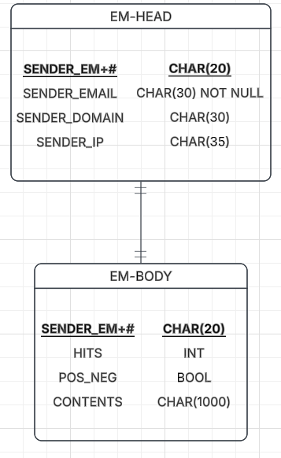
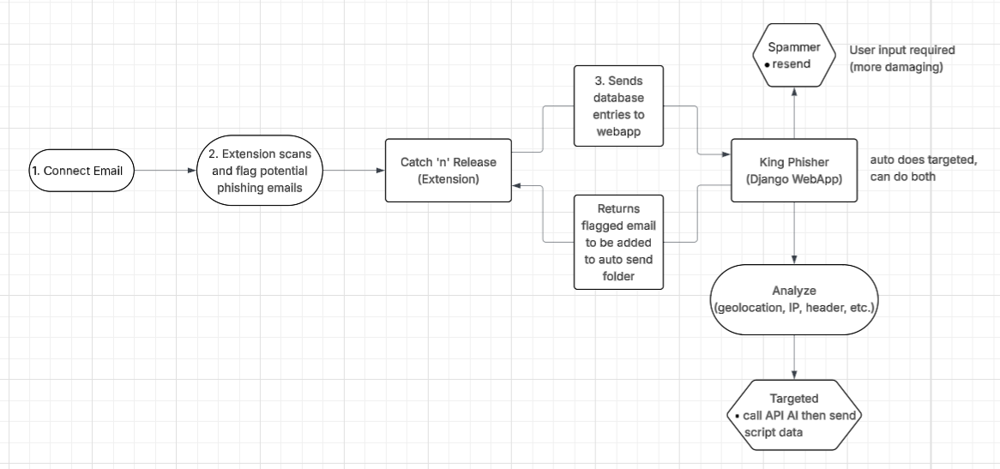

# Bear-Hacks-2026
This repo is for a Hackathon that runs from April 24th to April 26th 2026. My group consists of myself Erik Stiefeling, and two classmates Nick McClure and Lyndon Wagg.

These diagrams were generated as a mock idea for our project. They do not represent the final product.

### ER Diagram


### System Flow Chart


---

## King Phisher — Project Overview

**King Phisher** is a phishing email detection and counter-attack web application built with Django. It works alongside a Chrome extension (**Catch 'N' Release**) that reads a Gmail inbox  and submits their raw headers to the Django backend for analysis.

### How It Works

1. The **Chrome extension** monitors a user's Gmail inbox and sends suspicious email headers to the Django API using a per-user (in our case superuser) Bearer token.
2. Flagged emails appear in a **web dashboard** where the user can trigger a full analysis or dismiss the alert.
3. The **Django backend** parses those headers, evaluates SPF, DKIM, and DMARC authentication results, detects domain mismatches, and assigns a risk level: `safe`, `suspicious`, or `phishing`.
4. Confirmed phishing/suspicious senders can be targeted with a **counter-attack** that streams 100 emails back to the sender in real time via a terminal-styled UI.

### Django Apps

#### `analyzer` — Email Analysis Engine
The core of the project. Exposes a REST-style API consumed by the Chrome extension.

- **`/analyzer/analyze/`** — Accepts raw email headers (Bearer token auth), runs the analysis pipeline, and stores results with a risk level.
- **`/analyzer/flag/`** — Accepts a "pre-flagged" email from the extension (before full analysis) and queues it for dashboard review.
- **`/analyzer/flagged/<id>/analyze/`** — Triggers a full analysis on a queued email from the dashboard.
- **`/analyzer/flagged/<id>/dismiss/`** — Discards a queued email without analyzing it.
- **`/analyzer/result/<id>/delete/`** — Removes a saved analysis result.

**Risk logic:**
- 2+ auth failures (SPF/DKIM/DMARC) → **phishing**
- 1 auth failure + reply-to/sender domain mismatch → **phishing**
- 1 auth failure or domain mismatch → **suspicious**
- Extension flagged as mid/high risk → **suspicious**
- Otherwise → **safe**

**Models:**
- `APIToken` — Per-user tokens that authenticate the Chrome extension.
- `AnalysisResult` — Stores analyzed emails with full SPF/DKIM/DMARC results, provider, risk level, and raw analysis JSON.
- `FlaggedEmail` — Staging table for emails the extension flagged but that haven't been fully analyzed yet.

**Services (`analyzer/services/`):**
- `header_analyzer.py` — Main orchestrator: parses received chains, addresses, auth headers, and provider-specific headers.
- `auth_parser.py` — Regex-based extraction of SPF/DKIM/DMARC pass/fail/softfail from `Authentication-Results` headers.
- `provider_check.py` — Detects Gmail, Microsoft, or Yahoo based on provider-specific headers.
- `header_extractors.py` — MIME decoding and email address parsing utilities.

#### `dashboard` — Web UI
A login-protected interface for reviewing analysis results.

- **`/dashboard/`** — Shows two tabs:
  - **Pending Review**: Emails flagged by the extension awaiting analysis. Each row has "Send for Analysis" and "Dismiss" actions.
  - **Analysis Results**: Fully analyzed emails showing SPF/DKIM/DMARC status, risk badge, and a "Remove" option.
- All actions are handled client-side via `fetch()` with AJAX and CSRF tokens; rows are removed from the DOM on success without a page reload.
- Styled with an ocean/kingfisher theme (animated GIF, seaweed, floating particles).

#### `spammer` — Counter-Attack Module
Accessible from the dashboard for any confirmed phishing or suspicious sender.

- **`/dashboard/spammer/`** — Lists all phishing/suspicious `AnalysisResult` entries as targets.
- **`/dashboard/spammer/send/<id>/`** — Launches a counter-attack: sends 100 emails to the sender via Gmail SMTP and streams real-time progress back to the browser using `StreamingHttpResponse`.
- The UI renders a full-screen terminal overlay (green-on-black, monospace) showing each email's delivery status as it happens. A confirmation modal warns the user before initiating.

---

## Catch 'N' Release — Chrome Extension

**Catch 'N' Release** is a Manifest V3 Chrome extension that monitors a user's Gmail inbox for phishing indicators and forwards suspicious emails to the King Phisher backend for deeper analysis.

### Architecture Overview

| File | Role |
|---|---|
| `manifest.json` | Declares permissions, OAuth2 config, content scripts, and service worker |
| `config.js` | Shared configuration: API endpoints, scoring thresholds, weights, and regex patterns |
| `gmail.js` | Gmail API helpers: auth headers, message parsing, and local phishing scoring |
| `background.js` | Service worker: handles message routing between popup and Gmail API / Django backend |
| `popup.html` / `popup.css` | Extension UI: splash screen, email list, ocean/aquatic theme |
| `popup.js` | Popup logic: triggers scans, renders results, auto-flags medium/high-risk emails |
| `popup-splash.js` | Displays a 2.5-second branded splash screen on popup open |
| `detector.js` | Placeholder (detection logic lives in `gmail.js`) |

### Permissions & OAuth2

- **`identity`** — drives the Google OAuth2 sign-in flow to obtain a Gmail access token.
- **`storage`** — reserved for future local state persistence.
- **`scripting`** — allows content scripts to run on `mail.google.com`.
- **OAuth2 scope: `gmail.readonly`** — read-only access; the extension never modifies or deletes messages.
- **Content script** — `config.js` and `gmail.js` are injected into `mail.google.com` at `document_idle`.

### How It Works — Step by Step

1. **Splash screen** — on popup open, a 2.5-second splash is shown while the extension loads.
2. **Connect Gmail** — clicking the button sends a `PT_LOGIN` message to the service worker, which calls `chrome.identity.getAuthToken()` to perform interactive Google OAuth2 sign-in.
3. **Inbox scan** — the popup sends a `PT_LIST_MESSAGES` message; the service worker fetches up to **100** recent messages from `https://gmail.googleapis.com/gmail/v1/users/me/messages`.
4. **Score each message** — for every message ID, a `PT_FETCH_AND_SCORE` message triggers a full message fetch (`format=full`) followed by local phishing scoring in `gmail.js`.
5. **Render results** — each email is displayed with its sender, subject, numeric risk score, a risk label (`Low Risk` / `Medium Risk` / `High Risk`), and the forensic indicators that contributed to the score.
6. **Auto-flag** — any email scored as **Medium Risk or High Risk** is automatically POSTed to the Django backend via a `PT_FLAG_EMAIL` message, forwarding the raw headers, subject, sender address, and local risk label for server-side analysis.

### Local Phishing Scoring

The extension scores each email client-side before sending anything to the server. Scores are accumulated and compared against two thresholds:

| Threshold | Default | Risk Label |
|---|---|---|
| `WARNING_THRESHOLD` | 30 | Medium Risk |
| `DANGER_THRESHOLD` | 60 | High Risk |
| Below `WARNING_THRESHOLD` | — | Low Risk |

#### Scoring Signals & Weights

| Signal | Weight | How It's Detected |
|---|---|---|
| **Urgent language** | +20 | Regex scan of subject + body (normalised: `0→o`, `1→i`, `3→e`, `4→a`, `5→s`, `$→s`) for keywords: `urgent`, `action required`, `suspended`, `verify`, `password reset`, `bitcoin`, and ~20 others |
| **Sensitive attachment** | +45 | Attachment filename matches `.html`, `.js`, `.exe`, `.scr`, or `.zip` |
| **Homograph characters** | +50 | Plain-text body contains non-ASCII lookalike characters from Cyrillic, Greek, or IPA ranges |
| **Raw IP address URL** | +65 (35+30) | Any `http(s)://x.x.x.x/...` URL found in HTML `<a href>` tags or plain-text body |

> The homograph check is intentionally limited to the plain-text body — HTML bodies routinely contain Unicode typography (curly quotes, em-dashes) that would create false positives.

### Flagging Flow to Django

When an email scores Medium or High, the extension POSTs to `/api/flag/` with a Bearer token:

```json
{
  "gmail_message_id": "<Gmail message ID>",
  "subject": "<email subject>",
  "sender_email": "<From header>",
  "local_risk_label": "mid | high",
  "raw_headers": "<full RFC 2822 header block>"
}
```

The Django backend stores this in `FlaggedEmail` and surfaces it on the dashboard's **Pending Review** tab, where a user can trigger a full server-side SPF/DKIM/DMARC analysis or dismiss it.

### Configuration (`config.js`)

| Key | Default | Purpose |
|---|---|---|
| `GMAIL_BASE_URL` | `https://gmail.googleapis.com/gmail/v1/users/me` | Gmail REST API base |
| `MAX_SCAN_RESULTS` | `100` | Max messages fetched per scan |
| `DANGER_THRESHOLD` | `60` | Score at which an email is High Risk |
| `WARNING_THRESHOLD` | `30` | Score at which an email is Medium Risk |
| `ENABLE_CONSOLE_LOGGING` | `true` | Verbose logging to DevTools console |
| `AUTO_SCAN_ON_OPEN` | `true` | Run a full scan automatically when the popup opens |
| `DJANGO_BASE_URL` | `http://localhost:8000` | King Phisher backend URL |
| `API_TOKEN` | *(see config.js)* | Bearer token used to authenticate flagging requests |

### UI & Theme

The popup uses the same ocean/kingfisher aesthetic as the web dashboard: animated seaweed along the bottom, ten semi-transparent glowing particle GIFs layered at varying opacities, and the KingPhish logo. All email rows are rendered inside a `<ul>` with inline risk-badge colouring driven by the `low`, `mid`, and `high` CSS classes.

---

### Infrastructure & Configuration

| Setting | Value |
|---|---|
| Framework | Django 4.2.11 |
| Database | SQLite3 (`db.sqlite3`) |
| Email (SMTP) | Gmail — `kingphisher194@gmail.com`, port 587 TLS |
| Auth enforcement | Custom `LoginRequiredMiddleware` (exempts `/accounts/`, `/admin/`, `/analyzer/`, `/api/`) |
| CORS | Enabled for `/analyzer/` and `/api/` so the Chrome extension can call the API cross-origin |
| Timezone | America/New_York |

The `/api/` URL prefix mirrors `/analyzer/` entirely and exists specifically for the Chrome extension to call without being blocked by CORS or login middleware.
